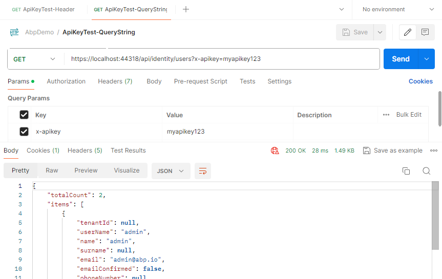

# AbpApiKeyDemo
API Key Authorization Demo for ABP Based Applications

API Key Authorization Module：https://github.com/cotur/abp-api-key-authorization

For module references and configuration, please refer to: https://github.com/cotur/abp-api-key-authorization?tab=readme-ov-file#how-to-install

## Test

### Header

Add the `x-apikey` parameter in the HTTP Header.

### QueryString

Add the `x-apikey` parameter in the QueryString. `?x-apikey=yourkey`

